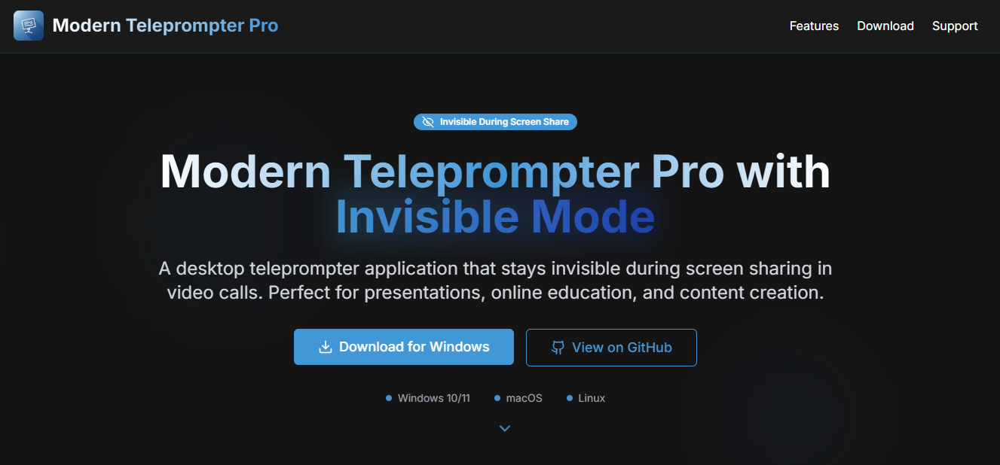
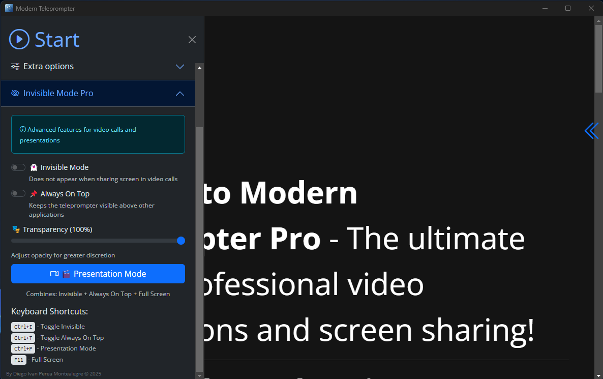
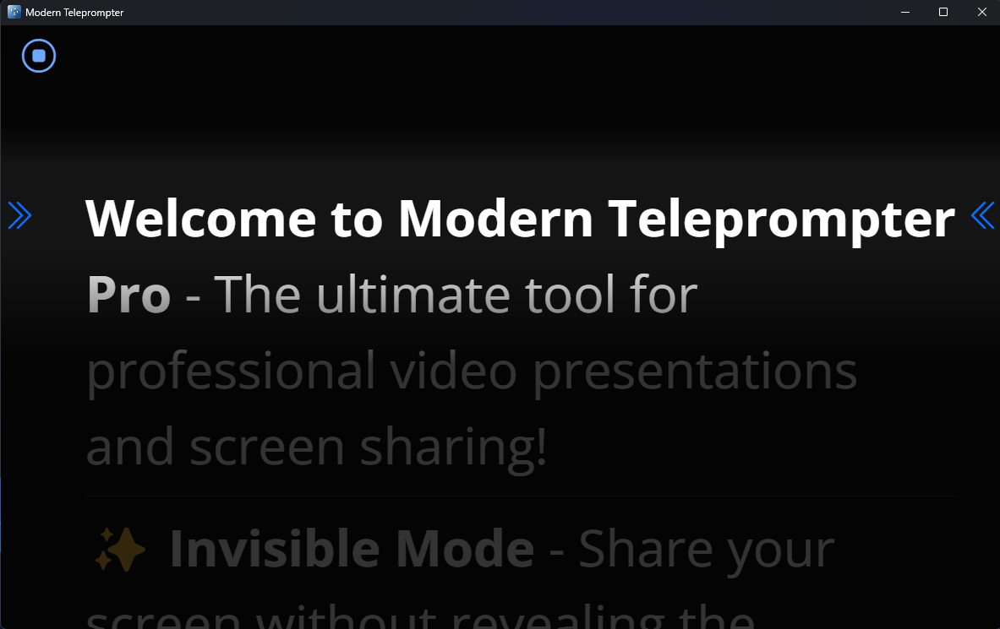
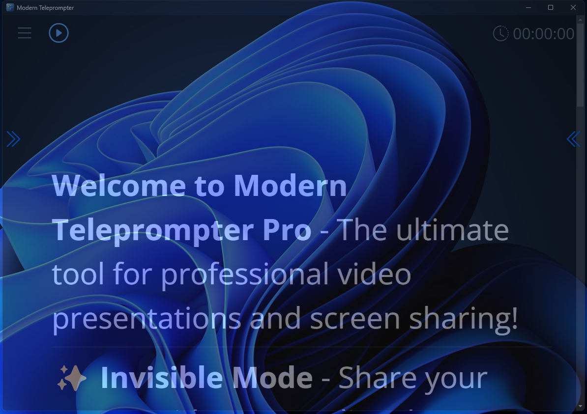

# 🚀 Modern Teleprompter Pro Landing page (Invisible Mode)

A landing page for desktop modern  teleprompter application built with Electron that has the special feature of being **invisible during screen sharing** in video calls, perfect for presentations and virtual meetings.


<p align="center">
  
</p>

<br>
<br>
<br>
<br>

-----


<p align="center">
  
</p>


<p align="center">
  
</p>


<p align="center">
  
</p>


<p align="center">
  
</p>


## ⚡ Fast Start for Modern Teleprompter Pro Landing page (2 minutes)

###  Install Dependencies

```bash
npm install
```

### 1. Run the Application

```bash
npm start
```

# The Application is on [Modern Teleprompter Pro](https://github.com/diegoperea20/modern-teleprompter-pro)

## 🎯 Main Use Cases

### 📹 Professional Video Calls

- Sales presentations
- Executive meetings
- Online interviews
- Live webinars

### 🎓 Online Education

- Virtual classes
- Video tutorials
- Academic conferences
- Online courses

### 🎮 Content Creation

- Streaming on Twitch/YouTube
- Tutorial recording
- Video podcasts
- Corporate presentations


## 🤝 Contributing

1. Fork the project
2. Create a feature branch (`git checkout -b feature/AmazingFeature`)
3. Commit your changes (`git commit -m 'Add some AmazingFeature'`)
4. Push to the branch (`git push origin feature/AmazingFeature`)
5. Open a Pull Request

## 📄 License

This project is under the  License. See the `LICENSE` file for more details.


---

## 👨‍💻 Author

**Diego Ivan Perea Montealegre**

- GitHub: [@diegoperea20](https://github.com/diegoperea20)

----

Created by [Diego Ivan Perea Montealegre](https://github.com/diegoperea20)

